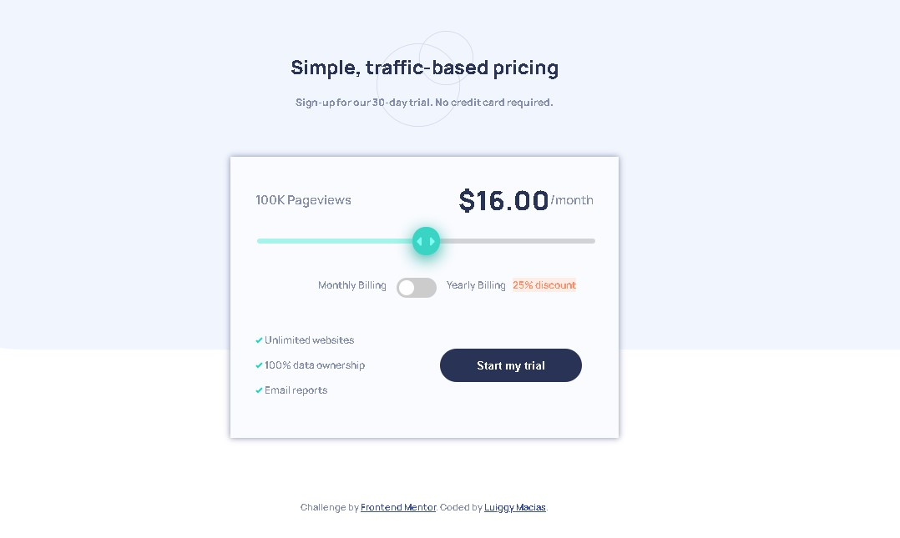

# Frontend Mentor - Interactive pricing component solution

This is a solution to the [Interactive pricing component challenge on Frontend Mentor](https://www.frontendmentor.io/challenges/interactive-pricing-component-t0m8PIyY8). Frontend Mentor challenges help you improve your coding skills by building realistic projects. 

## Table of contents

- [Overview](#overview)
  - [The challenge](#the-challenge)
  - [Screenshot](#screenshot)
  - [Links](#links)
- [My process](#my-process)
  - [Built with](#built-with)
  - [What I learned](#what-i-learned)
  - [Continued development](#continued-development)
  - [Useful resources](#useful-resources)
- [Author](#author)

## Overview

### The challenge

Users should be able to:

- View the optimal layout for the app depending on their device's screen size
- See hover states for all interactive elements on the page
- Use the slider and toggle to see prices for different page view numbers

### Screenshot




### Links

- Solution URL: [Add solution URL here](https://your-solution-url.com)
- Live Site URL: [Add live site URL here](https://your-live-site-url.com)

## My process

### Built with

- Semantic HTML5 markup
- CSS custom properties
- Flexbox
- CSS Grid
- Mobile-first workflow
- Jquery


### What I learned

i learned to make a range slider and a switch witch css, i also understood the differences between 'input' and 'change' events. To make the price change when the slider is moved I used jquery's input event

```js
sliderBar.on('input change', function () {
        //dependiendo de donde se encuentre el slider bar
        perMonth.text('$' + values[this.value] + '.00'); // muestra el precio correspondiente
        if (checkboxId.checked) {
            if (pageviewsList[this.value] == 12) {
                pageviews.text(pageviewsList[this.value] + 'M Pageviews');
            } else {
                pageviews.text(pageviewsList[this.value] + 'K Pageviews');
            } //muestra la centidad correspondiente
            //console.log(pageviewsList[this.value]);
            //console.log(this.value);
        } else {
            if (pageviewsList[this.value] < 10) {
                pageviews.text(pageviewsList[this.value] + 'M Pageviews');
            } else {
                pageviews.text(pageviewsList[this.value] + 'K Pageviews');
            } //muestra la centidad correspondiente
            //console.log(pageviewsList[this.value]);
            //console.log(this.value);
        }
    });
}
```


### Continued development

The javascript part was the one that took me the most time, so I would like to continue doing projects using javascript to be more efficient using it.


### Useful resources
[w3school](https://www.w3schools.com/) and [stackoverflow](https://stackoverflow.com/) were of great help to solve some doubts.

## Author

- Frontend Mentor - [@macluiggy](https://www.frontendmentor.io/profile/macluiggy)
- LinkedIn - [Luiggy Macias](https://www.linkedin.com/in/luiggy-macias-402696155/)

